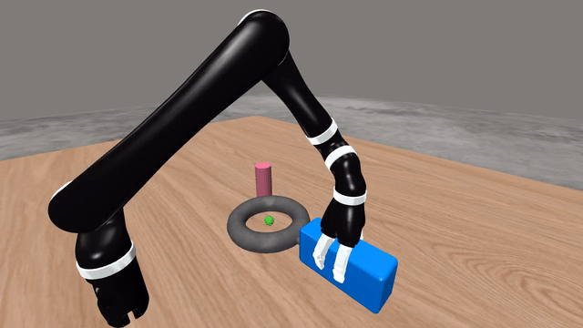
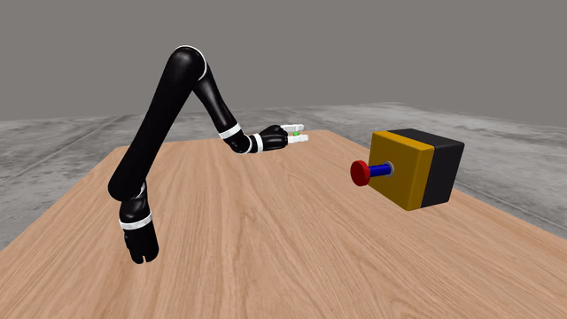
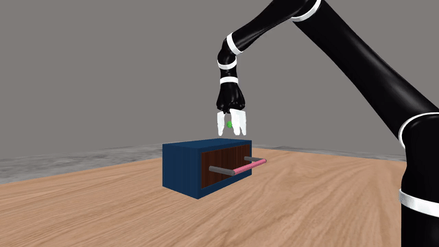
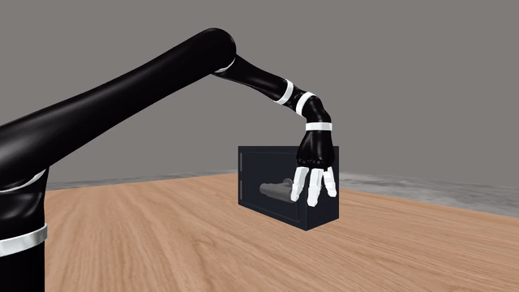
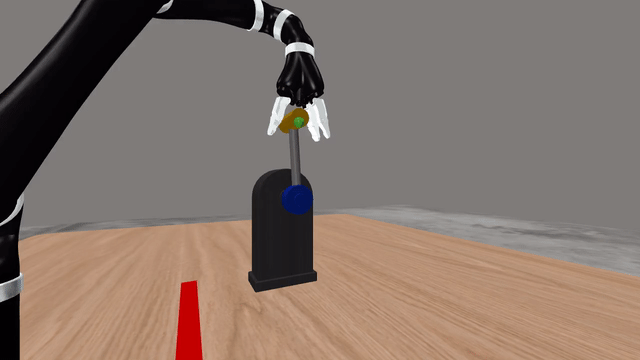
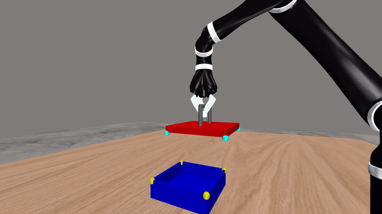
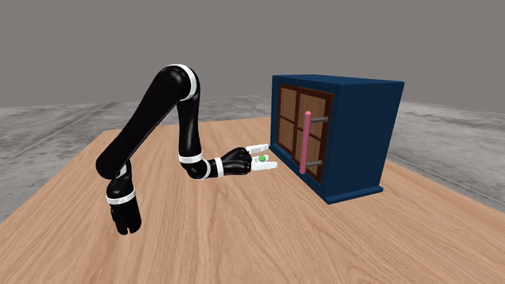
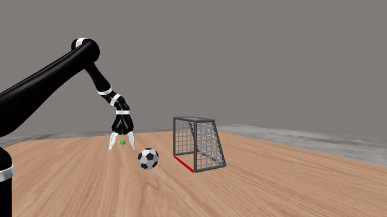

# Mujaco Gym Lite (Jaco2 + MuJoCo)

[](https://github.com/Shunichi09/mujaco-gym-lite/actions/workflows/build.yml) [](https://www.python.org/downloads/release/python-3100/) [](https://flake8.pycqa.org/) [](https://github.com/psf/black) [](https://pycqa.github.io/isort/)

`mujaco-gym-lite` is a lightweight task suite for robotic manipulation with the Kinova Jaco2 arm in MuJoCo.

It includes:

- MuJoCo-based manipulation tasks (drawer, button, door, assembly ring, hinged box, lever, soccer, lidded box)
- Example scripts for scripted demos and environment debugging

## Prerequisites

- Linux (this repository is developed and tested on Linux)
- Python 3.10
- MuJoCo Python bindings (`mujoco`) available in your environment
- OpenGL/GLFW runtime libraries for rendering

If you run with local rendering and miss system libraries, install them on Ubuntu/Debian:

```bash
sudo apt update
sudo apt install -y libglfw3 libgl1 libosmesa6
```

## Installation

### Local Python environment

```bash
git clone <your-fork-or-this-repo-url>
cd mujaco-gym-lite

python3 -m venv .venv
source .venv/bin/activate

pip install --upgrade pip setuptools wheel
pip install -e .

# Required for MuJoCo tasks
pip install mujoco "gymnasium[mujoco]"
```

### Docker (optional)

CUDA 12.6 Docker scripts are included in `dockerfiles/cuda126`.

```bash
cd dockerfiles/cuda126
./build.sh
./launch.sh
```

## Quick Start

Run any demo from the repository root.

```bash
python examples/run_drawer_open_demo.py
python examples/run_assembly_ring_demo.py
python examples/run_soccer_demo.py
```

Some demos support options such as recording:

```bash
python examples/run_drawer_open_demo.py --render_mode rgb_array --record
```

## Demo GIF Gallery

Recorded demos converted from examples/demo_result and stored in docs/demo_gifs.

### Assembly Ring



### Button



### Drawer



### Hinged Box Open



### Lever Pull



### Lidded Box Reach



### Sliding Door



### Soccer



## Available Environments

Registered Gymnasium IDs:

- `DrawerRobot-v0`
- `ButtonRobot-v0`
- `SlidingDoorRobot-v0`
- `AssemblyRingRobot-v0`
- `HingedBoxRobot-v0`
- `LeverRobot-v0`
- `SoccerRobot-v0`
- `LiddedBoxRobot-v0`

## Actions, States, and Rewards

### Actions

MuJoCo robot environments use `gymnasium.spaces.Dict` action spaces.
Typical keys include:

- `robot/end_effector/position` (3D target position)
- `robot/end_effector/rotation` (quaternion)
- `robot/home` (home command flag)
- `camera/<name>/position`, `camera/<name>/rotation` (for mocap camera control)

Exact keys can vary by task and wrappers.

### States (Observations)

Observations are also dictionaries and usually include:

- Robot state (end-effector pose, joint angles, contacts)
- Task/object state (for example object pose, handle position, joint positions)
- Camera outputs when enabled (color/depth/segmentation and camera parameters)
- Low-level simulator state (`qpos`, `qvel`)

### Rewards

Rewards are task-specific and generally dense/shaped to support learning.
For many manipulation tasks, reward terms combine:

- Progress toward the task goal (for example object alignment or opening distance)
- Control/interaction quality (for example grasp or caging quality)
- A success-related bonus when the task condition is met

Additional reward diagnostics are exposed through the `info` dictionary (for example `reward/*` keys and `task/success`).

## Repository Layout

- `mujaco_gym_lite/`: main package (environments, builders, wrappers, tools)
- `examples/`: runnable demo scripts
- `assets/`: object meshes, robot files, textures
- `dockerfiles/`: Docker build/run scripts

## License

Source code in this repository (excluding asset content) is licensed under the MIT License.

Asset licensing and attribution may differ by source. Please check the files inside the asset directories:

- `assets/objects/metaworld/README.md`
- `assets/robots/README.md`
- `assets/textures/README.md`

Use those asset files as the primary reference for origin and license/usage terms.
